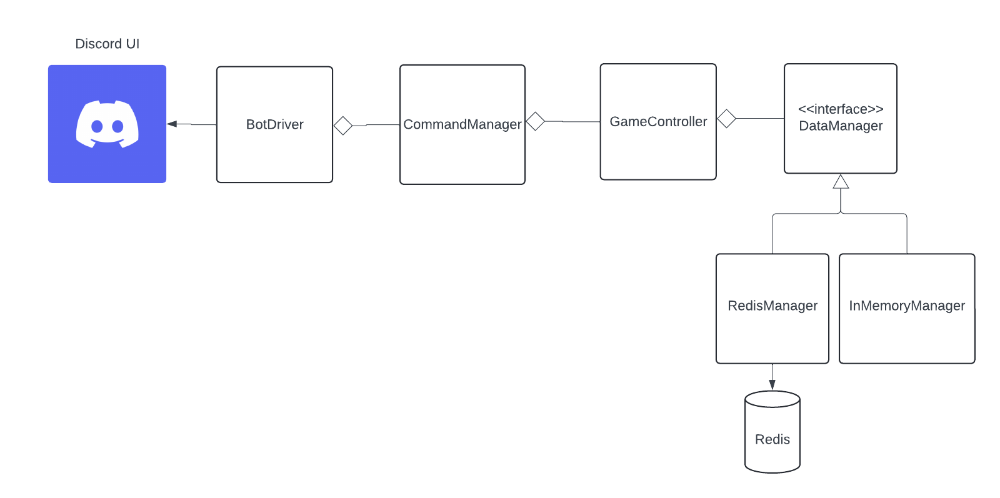

# Anagram Discord Bot

## CI Status 
 <br>

## Contributors 
* Jamell Alvarez <br>
* Jack Wagenheim <br>
* Jonathan Walsh

## Setup

The first step for either local deployment is to use git to clone the repo to your own device. A learner lab needs started for any of these methods to work. Once these steps have been completed, further setup changes depending on which way you prefer to deploy. 

### For Local Deployment:

First, ensure that brew is installed by running `brew -v`. If it is not, run the following command to install homebrew:
```sh
/bin/bash -c "$(curl -fsSL https://raw.githubusercontent.com/Homebrew/install/HEAD/install.sh)"
```

Next, find your `aws_access_key_id`, `aws_secret_acess_key`, and `aws_session_token`. They can be found in your learner lab under "AWS Details" > "AWS CLI". Format them in a text file named credentials, located in ~/.aws, as shown below (replacing "< VALUE >" with their corresponding values):

```sh
[default]
aws_access_key_id=< VALUE >
aws_secret_access_key=< VALUE >
aws_session_token=< VALUE >
```

Once that has been completed, cd into the repo, and change the permissions on the `LocalDeploy.sh` file by using the command `chmod +x LocalDeploy.sh`. You can now execute `./LocalDeploy.sh` as a command, which will deploy the bot.

### For LocalVM (Docker):

Ensure Docker is installed on your device with 'docker --version'. If not install 'Docker Desktop` via docker docs website, 
```sh
https://docs.docker.com/desktop/setup/install/mac-install/
```
Make sure Docker Desktop is running for these nexts steps, In your cloned repo run,
```sh
docker compose up
```
this will then launch a docker network with two containers: one for redis and another for the discord bot. To turn off the network and containers do,
```sh
docker compose down
```

### For EC2 Deployment (Docker):

In the AWS Learner Lab, go to the Secrets Manager service, and store a new secret. Give it the key name `DISCORD_TOKEN`, and the value of your own discord bot token. Repeat this step, storing another secret with the key name `CHANNEL_NAME`, using the name of the channel you want the bot to run in as the value.

Create a role connected to the secrets manager (or use the provided learner lab role labeled 'LabRole'), and attach it to the IAM Instance Profile advanced option after starting to create a new EC2 instance. Then, upload the contents of the `ec2Docker/userData.sh` file from the repo to the user data option. Finally, launch your instance. This will deploy the bot.


## Technologies Used

By using the Discord API, this project aims to create a bot that can play a word guessing game with users.
[Discord Developer Site](https://discord.com/developers/docs/intro)

The primary mode of data storage for this project is a Redis database, but the repository also contains an interface
that can be implemented with any data storage method such as in memory or in a SQL database.
[Redis Docs](https://redis.io/docs)

The software project management tool, Maven, is used to package the bot, so that it can be run as a .jar file.
[Maven Introduction](https://maven.apache.org/)

Docker packages applications with their dependencies into containers that run consistently across various environments.
[Docker Website](https://www.docker.com/get-started/)

AWS Secrets Manager allows the user to store sensitive information. It is used in this repo to store the discord token and channel name.
[AWS Secrets Manager Information](https://aws.amazon.com/secrets-manager/)

Installing both Maven and Java can lead to having multiple Java versions, since Maven also pre-installs a version of Java. The command `sudo yum install -y maven-amazon-corretto21` installs Maven and Java at the same time, with no duplicates.
[Corretto 21](http://docs.aws.amazon.com/corretto/latest/corretto-21-ug/what-is-corretto-21.html)

GitHub Actions allow us to run processes after certain actions, such as a push or pull of a repo. Actions used in this project are for deployment and test running.
[Github Actions information](https://learning.oreilly.com/library/view/github-actions-in/9781633437302)

Checkstyle checks coding styles before an action occurs. In the case of this repo, it checks the style before both a push or a pull request go through.
[Checkstyle Documentation](https://checkstyle.org/config.html)

## Background

[Information on setting up Apache Maven](https://docs.aws.amazon.com/sdk-for-java/latest/developer-guide/setup-project-maven.html)

[Getting a Secrets Manager value through Java](https://docs.aws.amazon.com/secretsmanager/latest/userguide/retrieving-secrets-java-sdk.html)

[Running commands on EC2 instance start with userData](https://docs.aws.amazon.com/AWSEC2/latest/UserGuide/user-data.html)

[Information on Implementing Checkstyle](https://www.baeldung.com/checkstyle-java)

[Docker Compose Startup Walkthrough](https://docs.docker.com/compose/gettingstarted/)


## Project Description

The bot will allow users to start a game, join, guess words, and stop the game. 
The bot will also keep track of the words that have been used in the game.


## System Diagram


**Overview**
- This system diagram can be described by breaking it up into three parts: The delivery mechanism, the app, and the data storage.

**Delivery**
- The program uses discord as the main method of delivery. BotDriver acts as the main for this part of the system. It listens for messages from discord and sends them to the controller to be processed. The CommandManager processes command signatures sent from the user. The CommandManager then either communicated with the GameController to process the command or sends an error message back to the user.

**APP**
- The app and game logic for this game are handled by the GameController. The GameController is responsible for managing the game state and processing commands. The GameController acts as a boundary between the game logic and the data storage of the program. That is, there is no other area in the program with access to the data storage.

**Data Storage**
- The data storage for this program is handled by the DataManager interface. This repository implements the DataManager interface in two ways
(so far, RedisManager and InMemoryManager). The DataManager objects are responsible for keeping track of data used for game processes. It also handles the input validation for guessing words.

## Usage

Users interact with the bot through the use of various commands.
These commands start with the prefix `!` and are followed by the command name.
The bot will then send the message to be executed by the controller class, which will either return a message to output
to the user, or will throw an exception, the message of which will be propagated to the user by the bot driver.

The following commands are available to the user:
- `!start`: start the game
- `!join`: join the game
- `!guess <word>`: guess a word
- `!stop`: stop the game
- `!used`: get used words
- `!status`: get game status
- `!help`: displays commands

This implementation of the app relies heavily on the use of the Discord API, but since the delivery mechanism is seperated from the game logic, the system design allows for any type of delivery implementation; for example, a command line interface or a web interface.
